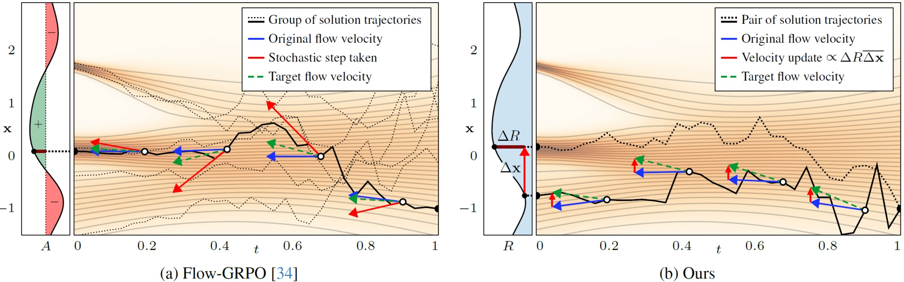

# FDFO: Finite Difference Flow Optimization



This repository contains the official reference implementation of FDFO, a method for fine-tuning flow-based diffusion models using finite difference gradient estimation. We fine-tune [Stable Diffusion 3.5 Medium](https://huggingface.co/stabilityai/stable-diffusion-3.5-medium) using reward signals from VLM-based scoring and/or PickScore.

**Finite Difference Flow Optimization for RL Post-Training of
Text-to-Image Models**<br/>
David McAllister, Miika Aittala, Tero Karras, Janne Hellsten, Angjoo Kanazawa, Timo Aila, Samuli Laine<br/>
https://arxiv.org/abs/2603.12893<br/>
https://mcallisterdavid.com/fdfo-blog

## Requirements

- **GPUs**: At least 4 NVIDIA GPUs with at least 48GB memory (tested on A6000, A100, and H200)
- **Python**: 3.11

### Environment setup

```bash
# Create conda environment
conda create -n fdfo python=3.11
conda activate fdfo

# Install dependencies
pip install torch torchvision torchaudio
pip install transformers accelerate diffusers numpy pillow scipy sentencepiece wandb tyro peft dreamsim

# Log in to HuggingFace (required for SD 3.5)
hf auth login

# Download PickScore prompts (required for training)
mkdir -p prompt_sets
curl -o prompt_sets/pickscore_train.txt https://raw.githubusercontent.com/yifan123/flow_grpo/9745241cf1101407e9b518dd4f10498092150522/dataset/pickscore/train.txt
```

We have tested the code with specific package versions [listed here](resources/pip_list.txt).

## Pre-trained checkpoints

We provide the full set of pretrained checkpoints for 5 representative training runs shown in the paper:

* https://huggingface.co/nvidia/finite-difference-flow-optimization
  * [fdfo-pickscore-reward-no-cfg](https://huggingface.co/nvidia/finite-difference-flow-optimization/tree/main/fdfo-pickscore-reward-no-cfg)
  * [fdfo-vlm-alignment-reward-no-cfg](https://huggingface.co/nvidia/finite-difference-flow-optimization/tree/main/fdfo-vlm-alignment-reward-no-cfg)
  * [fdfo-combined-reward-no-cfg](https://huggingface.co/nvidia/finite-difference-flow-optimization/tree/main/fdfo-combined-reward-no-cfg)
  * [fdfo-combined-reward-cfg-2.0](https://huggingface.co/nvidia/finite-difference-flow-optimization/tree/main/fdfo-combined-reward-cfg-2.0)
  * [fdfo-combined-reward-cfg-4.5](https://huggingface.co/nvidia/finite-difference-flow-optimization/tree/main/fdfo-combined-reward-cfg-4.5)

To generate a set of images for a given checkpoint, run:

```bash
export CHECKPOINT=https://huggingface.co/nvidia/finite-difference-flow-optimization/tree/main/fdfo-combined-reward-no-cfg/epoch-0000100
python generate.py --checkpoint $CHECKPOINT --out out.jpg
```

This should take a couple of minutes and produce a result like [this one](resources/out.jpg).

## Training

### Sanity check using a single GPU

We recommend first launching a short training run on a single GPU to ensure that the required dependencies are installed and HuggingFace models are in the cache:

```bash
python train.py --num-epochs 5 --total-pairs-per-epoch 16
```

This should take about 10&ndash;20 minutes and complete without errors.

### Reproducing our results using torchrun multi-GPU

To reproduce the results from our paper, launch the training script using at least 4 GPUs with the default options:

```bash
torchrun --nproc_per_node=8 train.py
```

We have verified that the the training script produces correct results with 4, 8, 16, 24, and 32 GPUs, and does not require more than 48GB of VRAM in these cases.
The results are expected to be reasonably good around 100 epochs, which takes about 12 hours to reach using 4 H200 GPUs, or 1.5 hours using 32 H200 GPUs.
By default, the training continues all the way until 1000 epochs to illustrate the tradeoffs associated with extended RL training.

### Outputs

- **Checkpoints**: Saved to `runs/<run_id>-<run_name>/checkpoints/`
- **Logging**: W&B logging available behind flag (`--log-wandb`)

### Reward configuration

FDFO supports multiple reward signals. Select a preset via `--reward-preset`:

- `pickscore` - PickScore only
- `vlm_alignment` - VLM prompt alignment only
- `combined` **(default)** - VLM prompt alignment + PickScore

For example:

```bash
torchrun --nproc_per_node=8 train.py --reward-preset pickscore
```

## Evaluation

Evaluate a given checkpoint using various metrics:

```bash
export CHECKPOINT=https://huggingface.co/nvidia/finite-difference-flow-optimization/tree/main/fdfo-combined-reward-no-cfg/epoch-0000100

# Training-time rewards
# 8min on 8xH200
# pickscore           22.4704
# vlm_prompt          61.7239
torchrun --nproc_per_node=8 metrics.py --checkpoint $CHECKPOINT \
    --prompt-set pickscore_train --num-prompts 4096 --num-repeats 1 --metrics pickscore vlm_alignment

# External control metrics
# 22min on 8xH200
# clip_h14            35.7743
# clip_l14            28.1932
# dreamsim_diversity  0.4550
# hpsv2               28.2949
torchrun --nproc_per_node=8 metrics.py --checkpoint $CHECKPOINT \
    --prompt-set hpdv2 --num-prompts 3200 --num-repeats 4 --metrics hpsv2 clip_h14 clip_l14 dreamsim_diversity
```

### Available metrics

- **CLIP-based**: `pickscore`, `hpsv2`, `clip_h14`, `clip_l14`
- **VLM-based**: `vlm_alignment` (prompt adherence), `vlm_quality` (professional quality), `vlm_photo` (photorealism)
- **Diversity**: `dreamsim_diversity` (requires `--num-repeats >= 2`)

## License

The FDFO source code and pretrained checkpoints are licensed under the [NVIDIA Source Code License v1 (Non-Commercial)](LICENSE.txt). Copyright &copy; 2026 NVIDIA CORPORATION & AFFILIATES. All rights reserved.

The Stable Diffusion 3.5 Medium Model is licensed under the [Stability AI Community License](https://stability.ai/community-license-agreement). Copyright &copy; Stability AI Ltd. All rights reserved. Powered by Stability AI.

## Development

This is a research reference implementation and is treated as a one-time code drop. As such, we do not accept outside code contributions in the form of pull requests.
